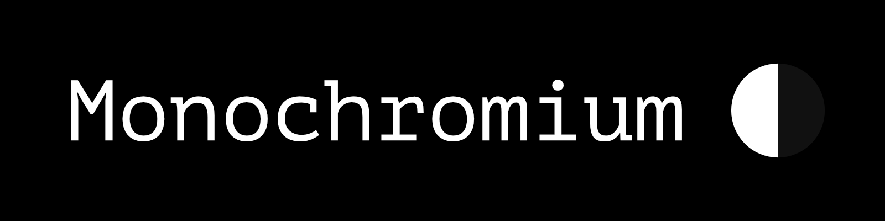
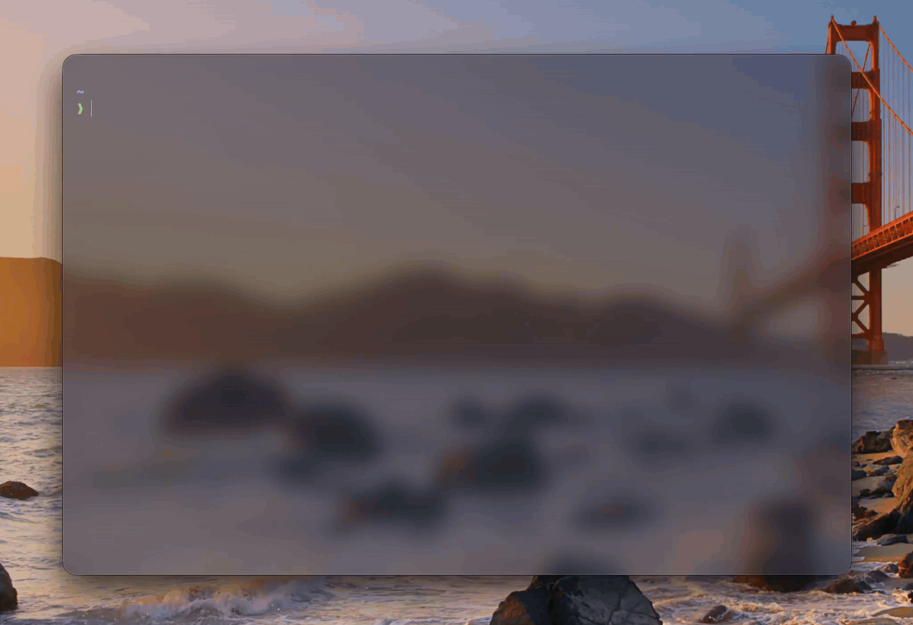

# Monochromium

> A fast, local first CLI note-taking app





Monochromium lets you capture ideas, tasks, and mental health check-ins all without leaving the terminal!

## Why Monochromium?

Most note-taking apps are clunky, require opening another app, and are not built for developers in the slightest.

Monochromium is crazy light, modern, and allows for blazing fast workflows fully in plain text!

## Features
- Blazing-Fast, Small Binary
- Multiple Note Types
- Search and Filtering
- Fully Local Notes with SQLite
- Human-Readable Terminal Output
- Shell reminder system

## Install

### From Source

> Requires Rust
```bash
git clone https://github.com/Papaya-Voldemort/Monochromium
cd Monochromium
cargo install --path .
```
### From Cargo (Recommended)

> Requires Rust
```bash
cargo install monochromium
```

### From Github Binary (MacOS)

> I was a little too tired to add this so a binary will come in future versions ;0


### Verify
```bash
mono --version
```

## Usage

```bash
mono add "Ship v1.0"
mono checkin
mono list --today
```

### Reminders

To opt into reminders, run the following command
> Mono Init updates your zshrc
```bash
mono init
```

## The Future

I already love the state Monochromium is in, but not all of our [spec.md](spec.md) is implemented fully. 
For future versions I want to add the following:
- All flags and commands
- Colored Outputs
- Tests (Yeah probably should be in a v0.1.0 but...)
- Other OS Releases
- Smaller Binary
- A few others

So year a little work to go for v1.0.0 but I am ready to make my first release for now :)

## Contributions

> We are a very small team (of 1) so your PRs may take several days to review :)

Contributions are completely welcome and accepted.

Feel free to submit a PR or a Issue for anything!

For larger changes please make and link and issue to keep things more trackable.

## License
MIT